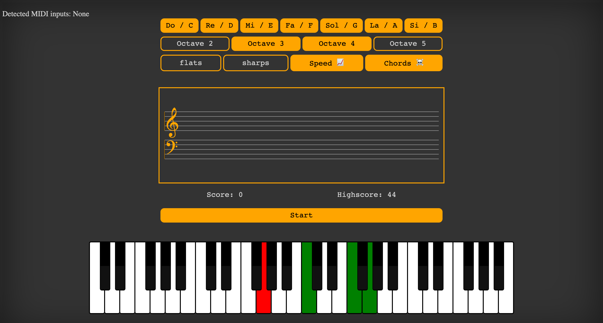

# js-score

### Web app to help with learning piano notes.

## Features: 

* Play directly on your MIDI keyboard, or use the keyboard on screen.
* Chose the notes that you want to be able to appear.
* Chose which clef and octaves notes appear on.
* Toggle-able option to gradually increase the speed at which notes appear.
* Chose between practicing notes or chords of notes to practice intervals.
* Score and highscore system. Highscore is saved uwing a cookie.
* See which note you played wrong on the screen keyboard.

## How to run locally:

Run `npm start`, on your browser go to `localhost:3001`.

